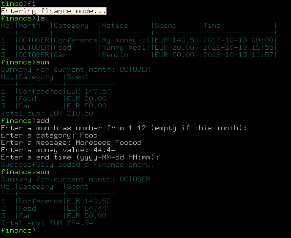

# Tinbo

General purpose extensible shell-like platform.

- Builds on top of Spring-Shell
- Supports different modes for command filtering
- Highly extensible through ServiceLoader pattern


Development at `https://gitlab.com/arturbosch/Tinbo`
Mirror at `https://github.com/arturbosch/Tinbo`

### Build

- `git clone git@github.com:arturbosch/Tinbo.git`
- `cd Tinbo`
- `./gradlew build`
- `./copyPlugins`
- `java -jar tinbo-platform/builds/libs/Tinbo-[VERSION].jar`

### Plugins

Official Tinbo plugins are:
- tinbo-time - time tracking & summaries
- tinbo-finance - finance tracking
- tinbo-notes - simple notes storage
- tinbo-tasks - simple tasks management
- tinbo-projects - PSP-like project management
- tinbo-charts - charts for time and project tracking (pie and burndown)
- tinbo-lloc - count logical lines of code for given path (JVM languages)
- tinbo-weather - shows weather for the next three days based on specified city
- tinbo-ascii - transforms given picture into ascii-art (semi-good)

Concept behind this plugins:
- Easy to use through the terminal
- Developed with 'i3 power user' in mind
- No database overhead, saves as csv, easy to modify out of tinbo


#### Screenshots
##### Time mode


##### Finance mode



### Write a Plugin

Follow this steps to create your own plugins:

- Create a project and add `tinbo-plugin-api` dependency

```
dependencies {
	compileOnly project(":plugin-api")
}
```
-  Create a class implementing the `TinboPlugin` interface and register your commands. Make use of TinboContext which is basically a wrapper over the spring context. Example from `tinbo-notes`:

```kotlin
@Component
class NotesPlugin : TinboPlugin {

	override fun registerCommands(tinboContext: TinboContext): List<Command> {
		val consoleReader = tinboContext.beanOf<ConsoleReader>()
		val tinboConfig = tinboContext.tinboConfig
		val persister = NotePersister(tinboConfig)
		val dataHolder = NoteDataHolder(persister, tinboConfig)
		val executor = NoteExecutor(dataHolder, tinboConfig)
		val noteCommands = NoteCommands(executor, consoleReader)
		tinboContext.registerSingleton("NoteCommands", noteCommands)

		val notesModeCommand = StartNotesModeCommand()
		tinboContext.registerSingleton("StartNoteModeCommand", notesModeCommand)

		tinboContext.registerSingleton("NotesPersister", persister)
		return listOf(noteCommands, notesModeCommand)
	}

}
```

- Write your shell commands, see [spring-shell documentation](http://docs.spring.io/spring-shell/docs/current/reference/html/) on how to write spring-shell commands or take a look at one of the tinbo-plugins.

```kotlin
@CliCommand("hello")
fun execute(): String {
    return "Hello World"
}
```

- Create a file `io.gitlab.arturbosch.tinbo.plugins` in `resources/META-INF/services`
and write down your fully qualified plugin names. (e.g. `io.gitlab.arturbosch.tinbo.lloc.LLOC`)

- Package up your plugin as a jar and put it in the Tino/plugins folder

- On the next start `tinbo` will locate your plugin and load it!

- If you use external dependency make sure to package them too. (e.g. with gradle: 
`jar { from { configurations.compile.collect { it.isDirectory() ? it : zipTree(it) } } }`)

- If your using maven for plugin development, run `gradle publishToMavenLocal` in `tinbo-plugin-api` folder first.